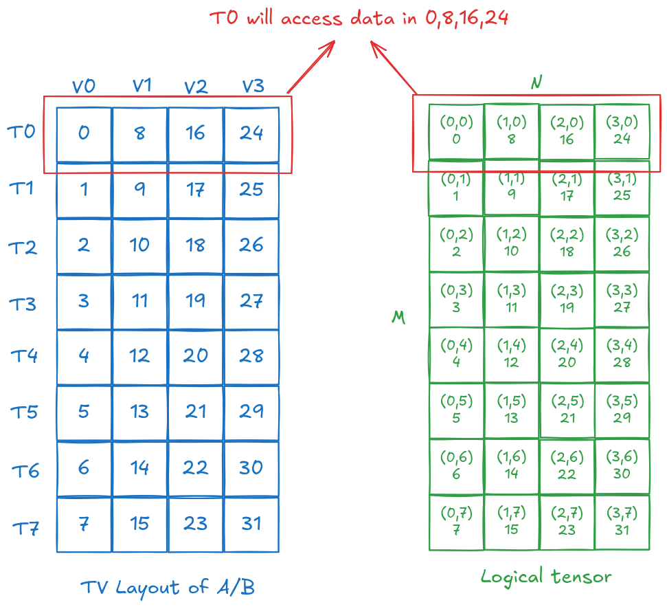
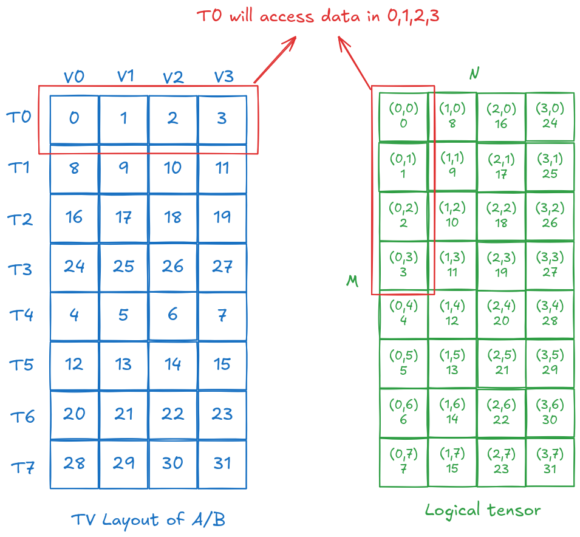

## MMA atom
This chapter is about the MMA atom, which is the basic unit of how we use tensor core to do mma.

### Contents
MMA in CUTE contains two parts: `Operation` and `MMA_Traits`.

#### Operation structs
Operation is something like: `SM70_8x8x4_F32F16F16F32_NT`.

* "SM70" refers to Volta.

* "8x8x4" refers to M = 8, N = 8, and K = 4,
  the dimensions of the MMA operation that the quadpair performs
  (see below). This is reflected in the PTX as `.m8n8k4.`.

* "F32F16F16F32" refers to the element types
  of the four matrix operands A, B, C, and D.
  An MMA computes D = C + A * B,
  so we read the types from left to right:
  D is F32 (`float`), A is F16 (half),
  B is F16 (half), and C is F32 (`float`). This is reflected in the PTX instruction name as `.f32.f16.f16.f32`.

* "NT" means that the PTX instruction is designed for inputs A as M-major (not transposed, column-major)
  and inputs B as N-major (transposed, row-major). This is reflected in the PTX instruction name as `.col.row.`.

This struct just contains some data about the registers, because we could understand this `Operation` just care about the ptx inst's self, so it just have:

```
using DRegisters = float[8];
using ARegisters = uint32_t[2];
using BRegisters = uint32_t[2];
using CRegisters = float[8];
```


#### Traits
Traits have more higher level contents than the `Operation`, like:

* `ValTypeD`: Logical compute type of the D matrix

* `ValTypeA`: Logical compute type of the A matrix

* `ValTypeB`: Logical compute type of the B matrix

* `ValTypeC`: Logical compute type of the C matrix

* `Shape_MNK`: Logical MxNxK shape of the MMA operation

* `ThrID`: Logical thread mapping within the single MMA operation
  (specifying the thread, quadpair, warp, or warpgroup view)

* `ALayout`: Mapping of (thread,value) pairs to coordinates in the MxK A matrix

* `BLayout`: Mapping of (thread,value) pairs to coordinates in the NxK B matrix

* `CLayout`: Mapping of (thread,value) pairs to coordinates in the MxN C matrix

It cares more about how the data for the whole MMA in lower level storage, like the data type and the `Layout`.


### Case study

In the below we will use a case for `SM70_8x8x4_F32F16F16F32_NT` as a case for discussing.

We could use `print_latex` to get the figure:


We will discuss the `TV Layout` for A, B and C (**NOTE: for this MMA, it use T0,1,2,3 and T16,17,18,19, follow convention, we could T16,17,18,19 as T4,5,6,7 in below**).

#### A and B

There is a feature for the operation called "NT", we will discuss two cases for it in below:


##### TN case
First let's see the A for TN case (right side figure).

We understand the `TV Layout` is a function from *coordinate* of `(thread, value)` to *coordinate* of `(m, n)` in the `Tensor` (**it's just a logical tensor, which don't replaces the data in any storage, like SRAM or GMEM**).

Therefore the A of TN case should be:

```
// 8 in shape is for threads, 4 in shape for values
ALayout = (8,4):(1,8)
```

And if we just rotate it for 90 degree, we could see the B of TN is also:

```
// 8 in shape is for threads, 4 in shape for values
BLayout = (8,4):(1,8)
```

We could illustrate it as:


##### NT case
Just like the TN case, we could get the `TV Layout` of A and B:

```
// first (4,2) in shape is for threads, 4 in shape for values
ALayout = (4,2),4:(8,4),1
BLayout = (4,2),4:(8,4),1
```

We could illustrate it as:


##### Summary

If we compare the `NT` and `TN` case, we could see the green logical `Tensor` have not changed, because **it's just the logical shape, we couldn't change it for the MMA**, but if we change the `NT` and `TN` it will select a differnet `TV Layout`, then it **ask different threads to load different values**.

#### C
For C there not about `TN` and `NT`, because they will generate same `Layout` of C, it looks like:


From the above figure we could define the `TV Layout` as:

```
// first (2,2,2) in shape is for threads, later (2,2,2) in shape for values
CLayout = (2,2,2),(2,2,2):(1,16,4),(8,2,32)
```

### Hopper MMA
**TODO: I don't have Hopper device, so I don't read this section.**

### Tiled MMAs

This section is about the Tiled MMA, it try to expand the `MMA atom` in two dimensions:
1. Using more warps, like allocate `2` or `4` warps in a thread block to do multiple MMA simultaneously.
2. Ask each warp to do a loop for run MMA multiple times.

If we define MMA as:

```
MMA_Atom mma = MMA_Atom<SM70_8x8x4_F32F16F16F32_NT>{};
print_latex(mma);
```

That's equivalent to:

```
TiledMMA mma = make_tiled_mma(SM70_8x8x4_F32F16F16F32_NT{},
                              Layout<Shape<_1,_1,_1>>{},   // Layout of Atoms
                              Tile<_8,_8,_4>{});           // Tiler
print_latex(mma);
```

We could see:


It's just a single `MMA atom` without multiple warps and loop iteration.

Then we could define another MMA as:

```
TiledMMA mma = make_tiled_mma(SM70_8x8x4_F32F16F16F32_NT{},
                              Layout<Shape <_2,_2>,
                                      Stride<_2,_1>>{});   // 2x2 n-major layout of Atoms
print_latex(mma);
```

We will see:


We could see now we have 4 of `8x8x4` MMAs, it's a 16x16x4 MMA.

**TODO: The left part is about reapet the MMA, but there is a question for the m8n8k4 case, why we repeat it then we will use the unused thread T4-T7 and T20-23?? Because for Ampere GPU, the m16n8k16 seems use all 32 threads in a warp, so the repeat is slightly different with here, try to figure it out later.**

### ValLayoutSrc/Des for LDSM
We will use something like `SM75_U32x4_LDSM_N` to utilize `ldmatrix` inst to load data from SMEM to register files, it may use something like `ValLayoutSrc/Des`, it's slightly different with `TV layout`.

we could define it as:

```
using s2r_copy_op = SM75_U32x4_LDSM_N;
using s2r_copy_traits = Copy_Traits<s2r_copy_op>;
using s2r_copy_atom = Copy_Atom<s2r_copy_traits, T>;
using S2RCopyAtomA = s2r_copy_atom;
```

Then we try to print `S2RCopyAtomA`:

```
S2RCopyAtomA{}: Copy_Atom
ThrID:        _32:_1
ValLayoutSrc: (_32,_8):(_8,_1)
ValLayoutDst: (_32,(_2,_4)):(_2,(_1,_64))
ValLayoutRef: (_32,(_2,_4)):(_2,(_1,_64))
ValueType:    16b
```

The `ThrID` means there is 32 threads to call this `ldmatrix` inst.

The `ValLayoutSrc` just means each thread will load `8 consercutive elements (128 bits / 16 bytes)`, but the `_8` in the stride doesn't make any sense because we will pass an address to `ldmatrix` inst in each thread to tell it the start address for each consercutive 8 elements.

The `ValLayoutDst` and `ValLayoutRef` means there're `32 threads`, and each thread loads `2x4=8` elements:
1. The stride `2` means each thread have a `2` as stride between each others in a `8x8` matrix.
2. The stride `1` means there're `2` elements are adjacent.
3. The stride `64` means there're `4` matrics, and each of them is `8x8` so the stride is `64`.

All the stride is just logical and match the define of the `ldmatrix` in NV doc.