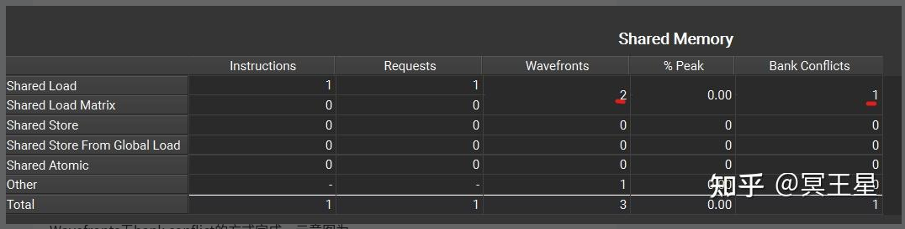
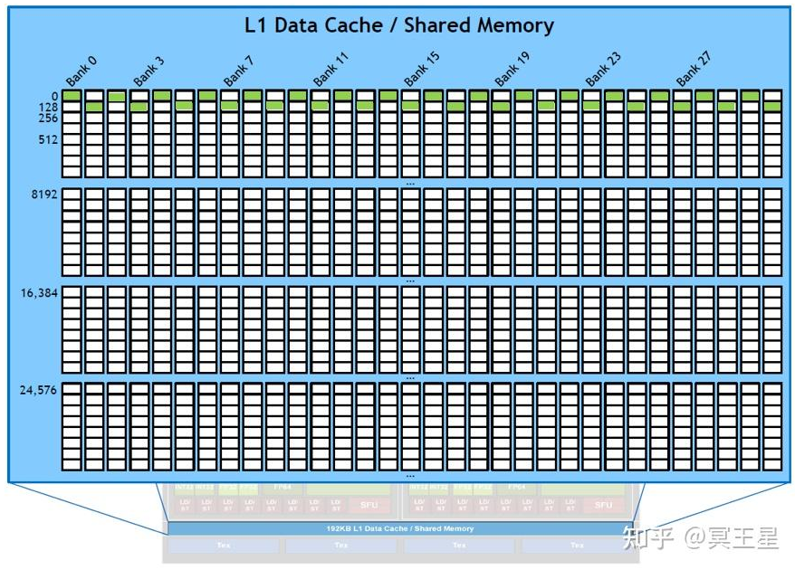
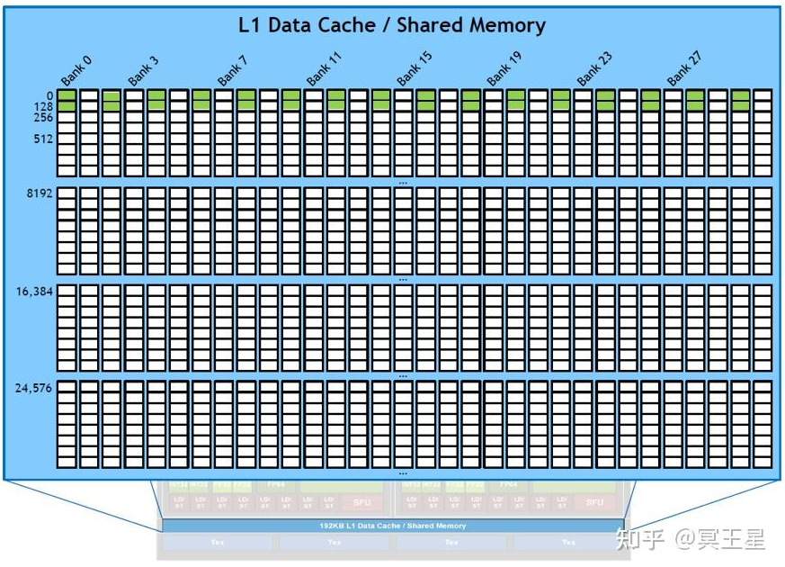
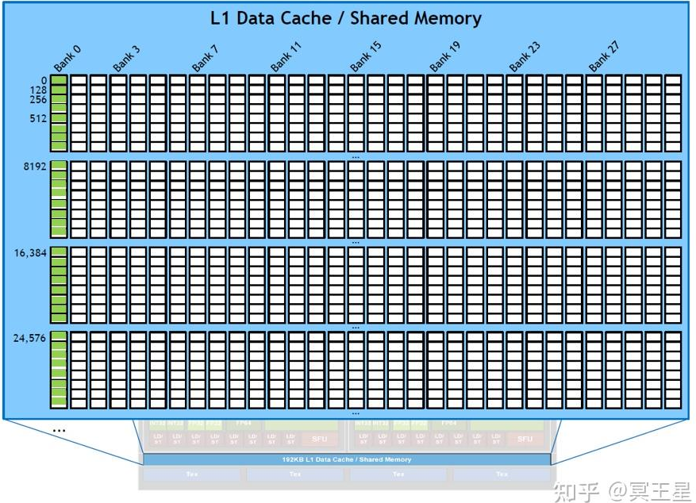
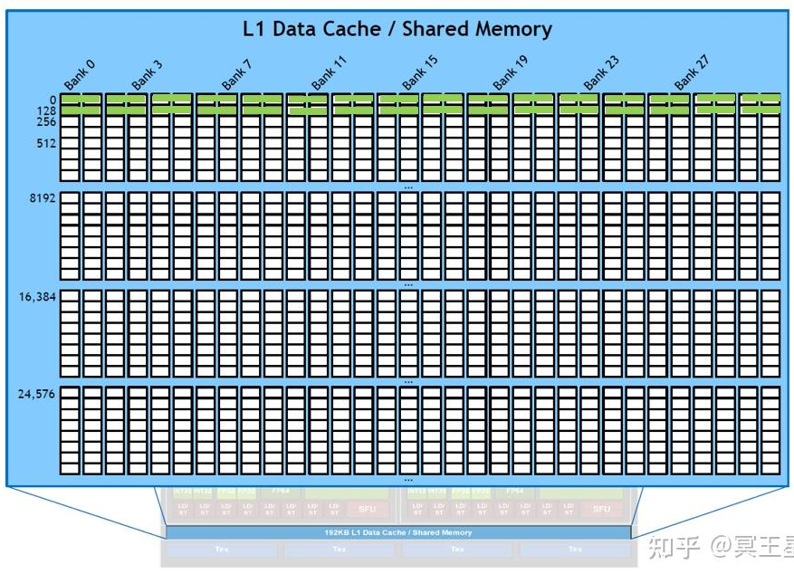
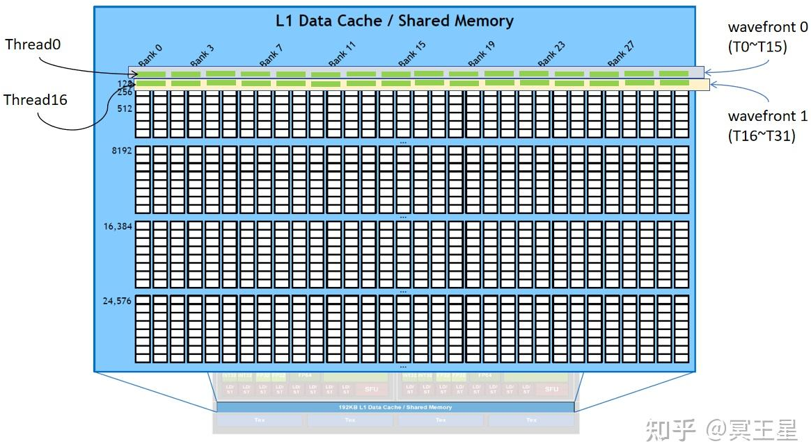

## A more general understand of bank conflict
This `.md` will discuss the most exact defination of **bank conflict**, it looks like:

$$
\text{Bank conflict} = \text{Real wavefront}-\text{Theoritic wavefront}\\
$$

**Wavefront** is the **smallest unit** for **a warp** to execute **an SASS inst** to **load/store** shared memory, the size of wavefront is **128 bytes**.

The $\text{Real wavefront}$ means how many wavefront the **warp/inst really issued**.

The $\text{Theoritic wavefront}$ means how many wavefront the **warp/inst should issue at least**.

We could see $\text{Real wavefront}$ in ncu:

### Case for LDS.32
`LDS.32` means each thread in a warp will load **32 bits(4 bytes)** from shared memory to its register, so **32 threads** in a **same warp** will totally load **4 * 32 = 128(bytes)** data from shared memory, in that case the $\text{Theoritic wavefront}$ is **1** (at least 1 wavefront could load all the 128 bytes data).

#### No bank conflict
If all the **32 * 4 bytes** are in different bank, the warp could load all them together in a same **wavefront**, so the $\text{Real wavefront}$ is **1**, it looks like:

In that case the **bank conflict is 0**.

#### 1 bank conflict
If all threads in a warp load data like that:

The warp/inst could load **16 banks in a wavefront** at most (because two threads share a same bank), so the $\text{Real wavefront}$ is **2**.

In that case we could say there is **1 bank conflict** `(1 = 2 - 1)`.

#### 31 bank conflict
If all threads in a warp load data within a same bank:

The warp/inst could load **1 banks in a wavefront** at most (because all 32 threads share a same bank), so the $\text{Real wavefront}$ is **32**.

In that case we could say there is **31 bank conflict** `(31 = 32 - 1)`.

### Case for LDS.64
In this section, we will discuss the case for `LDS.64`, we could image **each thread** in a warp will load **64 bits (8 bytes)**, the total traffic is **32 * 8 = 256 bytes**, in that case the $\text{Theoritic wavefront}$ is **2** (at least 2 wavefront could load all the 256 bytes data).

#### No bank conflict
For `LDS.64`, each thread may load data like that:

At first glance, it seems there is 1 bank conflict, but **there is no bank conflict**, why?

Because **the smallest unit of load/store for shared memory is wavefront**, so for `LDS.64` it will **issue 2 wavefront at least**, for the **1st wavefront**, it will handle all the data for `thread 0 - 15`, for the **2nd wavefront**, it will handle all the data for `thread 16 - 31`, it looks like:

Therefore the $\text{Real wavefront}$ is **2**, each will handle **16 threads in the warp**.

In that case we could say there is **0 bank conflict** `(0 = 2 - 2)`.

### Case for LDS.128 and LDS.16
It's similar to the above case, if you're interested in, please check them in the reference blog.

### Summary
The key point for understand **bank conflict** is $\text{Real wavefront}$ and $\text{Theoritic wavefront}$:
1. $\text{Real wavefront}$ is how many wavefronts the warp/inst issued when executing, **it's influenced by the thread access layout**.
2. $\text{Theoritic wavefront}$ is how many wavefronts warp/inst have to issue at least, **it's defined by the inst's self** (how many bits the inst will load/store).

### Reference
A [blog](https://zhuanlan.zhihu.com/p/**18702585291**) about bank conflict.

A [vedio](https://www.nvidia.com/en-us/on-demand/session/gtcspring22-s41723/) about shared memory access