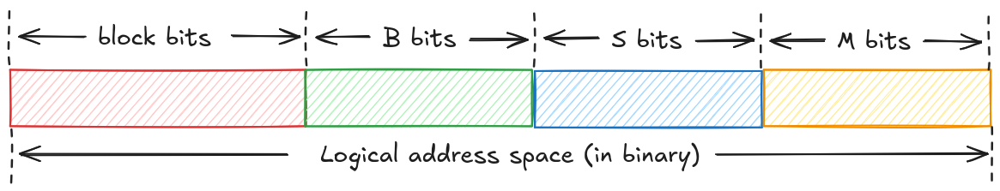

# LD.MATRIX
`ld.matrix` is a GPU inst which used to load data from shared memory to register before execute a `mma` inst.

## Case study
Let's take `ldmatrix.sync.aligned.m8n8.x4.shared.b16 {%0, %1, %2, %3}, [%4]` as an example, it will loads data from `[%4]` in smem to register `%0, %1, %2, %3`, each threads will use their own registers and some specific address.

It's very straightforward that `%0, %1, %2, %3` is an array for registers, but what's `[%4]` in each thread?

From NV doc, it said "**Each address corresponds to the start of a matrix row. Addresses addr0–addr7 correspond to the rows of the first matrix, addresses addr8–addr15 correspond to the rows of the second matrix, and so on.**".

| .num | Threads 0–7 | Threads 8-15 | Threads 16–23 | Threads 24–31 |
| ---- | ----------- | ------------ | ------------- | ------------- |
| .x1  | addr0–addr7 | – | – | – |
| .x2  | addr0–addr7 | addr8–addr15 | – | – |
| .x4  | addr0–addr7 | addr8–addr15 | addr16–addr23 | addr24–addr31 |

For a `.x4` case, which means there is 4 `8x8` matrix, the address argument for each thread looks like (try to draw a diagram from excalidraw later):

```
-------------------------------------------------------
| t0  | ... 7 elements ... | t8  | ... 7 elements ... |
| t1  | ... 7 elements ... | t9  | ... 7 elements ... |
| ................................................... |
| t7  | ... 7 elements ... | t15 | ... 7 elements ... |
------------------------ half -------------------------
| t16 | ... 7 elements ... | t24 | ... 7 elements ... |
| t17 | ... 7 elements ... | t25 | ... 7 elements ... |
| ................................................... |
| t23 | ... 7 elements ... | t31 | ... 7 elements ... |
-------------------------------------------------------
```

## How GPU execute ld.matrix
We could divide this inst into two parts:
1. Loading from shared memory
2. Storing data in threads' registers

We shouldn't think this inst in a **normal GPU SIMT** way, just like the `mma` inst, we should think the GPU do this inst in a more **ASIC** way, the `ld.matrix` inst was executed in a **unit of warp**, all the data was executed by **the whole warp but not a single thread**.

### Loading from shared memory
For `ldmatrix.sync.aligned.m8n8.x4.shared.b16 {%0, %1, %2, %3}, [%4]`, it will load **4 * 8 * 8=256** elements, the size of each element is **2 bytes**, so the total load size for this inst is **256*2=512 bytes**, given that the GPU core load data from shared memory in wavefronts (**128 bytes per one**), so this inst will issue **4 wavefronts** at least.


### Storing in threads' registers
After loading data from shared memory, then it will store the data into register follow a specific rules, it looks like:

.

## Swizzling and bank conflicts
In the above section, we could see this inst will issue 4 wavefront at least, and **each wavefront loads 128 bytes**(`8*8=64 elements, 64*2=128 bytes`), so what we want to do is **placing the 128 bytes in different 32 banks**.

### Swizzling layout
Let's focus on the **potential bank conflict between shared memory to register** (because in global memory to shared memory, there very low possibility for bank conflict, because it loads **consecutive data in global memory** and store it in **consecutive shared memory**, so they may **naturally span in different banks**), it looks like:


What we want to do is to swizzling the data in shared memory with **same logic column** into **different physical column** (for row-major shape), just like the above image.

### Swizzling algorithm

How could we design a swizzling algorithm in below (it's slight different from the offcial [cutlass cute implementation](https://github.com/NVIDIA/cutlass/blob/release/4.2/include/cute/swizzle.hpp#L42-L53), I'm not very clear about the S bits in the cutlass, **TODO: try to read it carefully later**):

$$
\text{Swizzle<B, M, S>(logical\_row,logical\_col)}=\text{(physical\_row,physical\_col)}\rArr\text{physical\_offset}
$$

I'm not very clear about what B, M and S stand for in the above formula, but we could understand them in **3 different bits** in the **logical address space**, it looks like:



There're 4 kinds of bits to compose the **Logical address space**, we could understandt it's the address space for a tensor/matrix in shared memory in a SM, for example, for a tile of weight matrix in shared meory with shape as **`64*64 (sub_tile_size * column_per_block)`**, why I call it **`sub_tile_size`** is very interesting, because the tile size may be **a multiple of 64**, but the **`sub_tile_size`** should always be **64** for bank conflict free, please see detail in later.

For the 4 kinds of bits we use it for:
1. block bits: it defines the index of a block in the whole logical address space.
2. **B** bits: **B** bits denotes something we called **iRow**, we could understand it's an index for row in the address space, **the max number of B is how many rows in a block**.
   we define it as **3** in `ld.matrix.m8n8.x4`, because we want to keep it same as **S** to **make all iCol in different banks**.
   The size of a row is usually **128 bytes** (the size of a wavefront, which could be load/store in a cycle for GPU), which means the **sum of S and M should be 6** (`2^6=64, 64*2 bytes_per_element=128 bytes`)
3. **S** bits: **S** bits denotes something we called **iCol**, we could understand it's an index for column in the address space, **the max number of S is how many columns in a block**.
   we define it as **3** in `ld.matrix.m8n8.x4`, because the sum of **S** and **M** is **6**, and we will define **M** as **3**.
4. **M** bits: **M** bits means we would like to keep how much number of elements we want to **keep them in consecutive**.
   we define it as **3** in `ld.matrix.m8n8.x4`, because we want each row in the `m8n8` matrix have consecutive **8** (`2^3=8`) elements in columns.

Based on the above defination, we know that we will define all **B, M and S** as **3**.

## Simple code snippet (not optimal, bank conflicts exist)
There is a case it use **1** thread block and **32** threads in this block to load a `16*16` matrix with `m8n8.x4`, please compile it with `nvcc -arch=sm_80 ldmatrix.cu`:

<details>
<summary>code</summary>

```cpp
// Build with `nvcc -arch=sm_80 ldmatrix.cu`

#include <iostream>
#include <vector>
#include <cuda_bf16.h>
#include <cuda_runtime.h>
#include <random>
#include <algorithm>

using bfloat16 = __nv_bfloat16;

const int input_row = 16;
const int input_col = 16;
static_assert(input_row == input_col);
const int input_size = input_row * input_col;

__device__ __forceinline__ void ldsm(bfloat16 *__restrict__ smem_ptr, uint32_t *R) {
  uint32_t smem_int_ptr =
      static_cast<uint32_t>(__cvta_generic_to_shared(smem_ptr));
  asm volatile(
      "ldmatrix.sync.aligned.m8n8.x4.shared.b16 {%0, %1, %2, %3}, [%4];\n"
      : "=r"(R[0]), "=r"(R[1]), "=r"(R[2]), "=r"(R[3])
      : "r"(smem_int_ptr));
}

__global__ void ld_matrix(const void* input_ptr) {
    const bfloat16* input = reinterpret_cast<const bfloat16*>(input_ptr);
    extern __shared__ bfloat16 smem[];
    if(threadIdx.x == 0) {
        // initialize the shared memory
        for(size_t i = 0; i < input_size; i ++) {
            smem[i] = input[i];
        }
    }

    // waitting for shared memory ready.
    __syncthreads();
    const int lane_id = threadIdx.x % 32;

    uint32_t regs[4];
    // Please refer to https://docs.nvidia.com/cuda/parallel-thread-execution/#warp-level-matrix-instructions-ldmatrix.
    // The 16 * 16 matrix and the pointer to each lane in a warp looks like:

    // -------------------------------------------------------
    // | t0  | ... 7 elements ... | t8  | ... 7 elements ... |
    // | t1  | ... 7 elements ... | t9  | ... 7 elements ... |
    // | ................................................... |
    // | t7  | ... 7 elements ... | t15 | ... 7 elements ... |
    // ------------------------ half -------------------------
    // | t16 | ... 7 elements ... | t24 | ... 7 elements ... |
    // | t17 | ... 7 elements ... | t25 | ... 7 elements ... |
    // | ................................................... |
    // | t23 | ... 7 elements ... | t31 | ... 7 elements ... |
    // -------------------------------------------------------

    bfloat16* thread_ptr = smem;
    // if lane id < 16, we will take it as the upper half
    const int row_offset = ((lane_id & 0x10) >> 4) * 8;
    // if lane id & 0x8, we think they're left half
    const int col_offset = lane_id & 0x8;

    const int row = row_offset + (lane_id & 0x7);
    const int col = col_offset;
    thread_ptr += row * input_row + col;
    ldsm(thread_ptr, regs);

    {
        // load finished and check here.
        if(lane_id == 0) {
            // each thread load 4 32 bits reg, so there is 8 elements.
            for(int i = 0; i < 8; i ++) {
                float tmp = (reinterpret_cast<bfloat16*>(regs))[i];
                printf("At lane 0, the %dth reg is %f\n", i, tmp);
            }
        }
        // Other threads wait here.
        __syncthreads();
    }
}

#define CUDA_CHECK(call) do { \
    cudaError_t err = call; \
    if (err != cudaSuccess) { \
        std::cerr << "CUDA Error: " << cudaGetErrorString(err) << " at " << __FILE__ << ":" << __LINE__ << std::endl; \
        exit(1); \
    } \
} while (0)


int main() {
    std::vector<bfloat16> host(input_size);

    // Initialize host data (Example with dummy values)
    for (size_t i = 0; i < input_size; ++i) {
        host[i] = __float2bfloat16(i);
    }

    void* device = nullptr;

    CUDA_CHECK(cudaMalloc(&device, input_size * sizeof(bfloat16)));

    // Copy data from host to device
    CUDA_CHECK(cudaMemcpy(device, host.data(), input_size * sizeof(bfloat16), cudaMemcpyHostToDevice));

    CUDA_CHECK(cudaDeviceSynchronize());

    ld_matrix<<<1, 32, input_size * sizeof(bfloat16)>>>(device);

    CUDA_CHECK(cudaDeviceSynchronize());

    return 0;
}
```

</details>

The output looks like:
```
At lane 0, the 0th reg is 0.000000
At lane 0, the 1th reg is 1.000000
At lane 0, the 2th reg is 8.000000
At lane 0, the 3th reg is 9.000000
At lane 0, the 4th reg is 128.000000
At lane 0, the 5th reg is 129.000000
At lane 0, the 6th reg is 136.000000
At lane 0, the 7th reg is 137.000000
```


## Reference
[Official doc](https://docs.nvidia.com/cuda/parallel-thread-execution/#warp-level-matrix-instructions-ldmatrix)
[A blog](https://zhuanlan.zhihu.com/p/697228676)
[A blog](https://zhuanlan.zhihu.com/p/18702585291)
[A blog](https://zhuanlan.zhihu.com/p/671419093) about swizzle
[A blog](https://leimao.github.io/blog/CuTe-Swizzle/) about cute swizzle