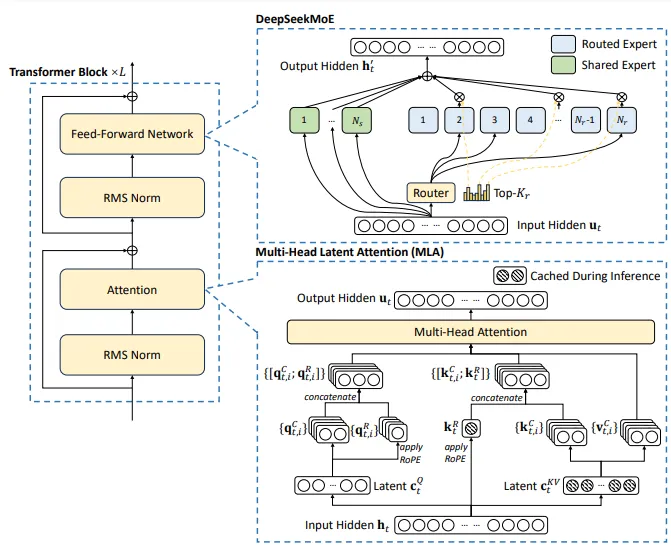

## Deepseek

This folder contains an `.py` file about some technologies which helps improve the performance for deepseek model.

The idea came from this [blog](https://medium.com/@atulit23/implementing-multi-head-latent-attention-from-scratch-in-python-1e14d03fbc91).

### MLA
MLA was used for lossy compress the $Q,\ K,\ V$ (they called **down-project**), then do decompress (they called **up-projection**) to finish the attention. It was inspired from **LoRA**, it shows there are much redundant dim in current AI model.
#### Benefits
1. KV cache
   
    | attention | kv cache size |
    | --------- | ------------- |
    | MHA | $2n_hd_hl$ |
    | GQA | $2n_gd_hl$ |
    | MQA | $2d_hl$ |
    | MLA | $(d_c + d^R_h)l$ |

    The symbol in above table:
    $n_h$ is the number of heads.
    $d_h$ is the dim size of one head.
    $l$ is the number of one transformer layers.
    $n_g$ is the number of group key/value heads.
2. Matrix multiple in convert the hidden state $H$ into the $K,\ V$ (omit the RoPE matrix).

$$
\begin{align*}
\frac{\text{MLA ops}}{\text{MHA ops}}
&\approx \frac{(2n_hd_h + n_hd_h)d_cSB}{4(n_hd_h)^2SB} \\
&= \frac{3d_c}{4n_hd_h}
\end{align*}
$$

The $\frac{d_c}{n_hd_h}$ is the compress ratio ($<1$), so we could image it also reduce the computation for matrix multiply.

#### MLA on TP
MLA is not very friendly to TP (tensor parallel), that's why GQA is still dominating the LLMs.

Let's image $\text{TP}\_\text{size} = 2$, we have to repeat the $d_hl$ KV cache size to 2 GPUs, beacause in TP, we couldn't just store half of the latent KV cache in each GPU, the FC layer looks like:

$$
(B \times S, d_c)\ @\ (d_c, d_h) = (B \times S, d_h)
$$

If we split $d_c$ in TP, like:

$$
(B \times S, \frac{d_c}{2})\ @\ (\frac{d_c}{2}, d_h) = (B \times S, d_h)
$$

It's **wrong**!!!, we should use a whole row ($d_c$) to do calculation.

As for **GQA**, we could just assign a KV head to a GPU (when GPU size smaller or equal to KV head).

Therefore, in TP, **the MLA is not all you need**!!!

### MoE
MoE applies after the attention, it just pick top k experts for doing FFN (feed-forward network).

Reference:
1. a [blog](https://liorsinai.github.io/machine-learning/2025/02/22/mla.html#mla-cache)
2. a [code case](https://medium.com/@atulit23/implementing-multi-head-latent-attention-from-scratch-in-python-1e14d03fbc91)