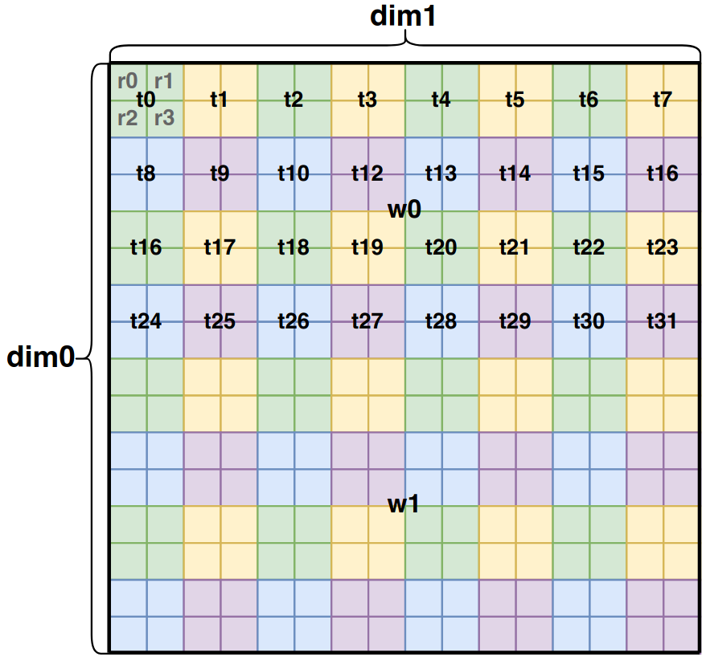

# Linear layout
Linear layout was designed to map the **hardware resource** into the **logical tensor**, eg: the data in `register 0, lane 1, warp 2, block 3` was mapped to tensor at `tensor[4][5]`, so it may be a **MD -> ND** (surjective or injective) map.

A [paper](https://arxiv.org/pdf/2505.23819) about it.

## Code
The majority implement was at `include/triton/Tools/LinearLayout.h` or `lib/Tools/LinearLayout.cpp`, there is a draft design doc about it in the begin of `LinearLayout.h`.

## How it works
briefly speak, There are **input dims** and **output dims** in linear layout, **input dims** is something like: `"register", "lane", "warp"` (each of them has **a field about size**), and **ouput dims** is something like: `"dim1" and "dim2"` (each of them also has **a field about size**).

Therefore we could have a matrix multiply in $\mathbb{F}_2$ space (the matrix multiply is also slightly different from trandition matrix multiply, pleasee details in the paper mention above) to illustrate the map:

$$
(\sum \log_2\text{OutDimSize}, \sum \log_2\text{InDimSize}) \times (\sum \log_2\text{InDimSize}, 1) = (\sum \log_2\text{OutDimSize}, 1) \tag{1}
$$

The $\text{OutDimSize}$ and $\text{InDimSize}$ are the size for output or input's dim.

### 16 * 16 tensor case
Let's assume we have a `16 * 16` tensor, we want to map it like the below case:


The $i$ in $r_i$ means $i$th register, $i$ in $t_i$ means $i$th thread and $i$ in $w_i$ means $i$th warp.

In this case we have 3 input dimesions: **"reg", "thr" and "wrp"**, the size of each of them are: **4, 32 and 2**.
And 2 output dimesions: **"dim1" and "dim2"**, the size of both of them are **16**.

### Input dim
There are 3 input dimension, we will discuss two of them to show how each of them works, and then combine them together.
#### Register dim
We could see there are **4 registers** in a thread, and we would like to map it to a **16*16 tensor**, we could assume it just map the the first 4 elements in the left-upper corner.

According to $formula (1)$, we could get a map looks like:

$$
\begin{align*}
&(\log_{2}16 + \log_{2}16, \log_{2}4) \times (\log_{2}4, 1)\\
&=(4+4, 2)\times(2, 1)\\
&=(8,2)\times(2,1)
\end{align*}
$$

Which means we could use a `(8, 2)` matrix to map **4 registers**(it could be writen by a `(2, 1)` matrix in $\mathbb{F}_2$ space).
We could write the matrix multiply like ($j$ and $i$ is the **index of the register** in binary format):

$$
A \times B = \begin{bmatrix}
1 & 0 \\
0 & 0 \\
0 & 0 \\
0 & 0 \\
0 & 1 \\
0 & 0 \\
0 & 0 \\
0 & 0 \\
\end{bmatrix}
\times
\begin{bmatrix}
j \\
i
\end{bmatrix} = 
\begin{bmatrix}
1 \\
0 \\
0 \\
0 \\
0 \\
0 \\
0 \\
0 \\
\end{bmatrix} \times
\begin{bmatrix}
j \\
\end{bmatrix} \oplus 
\begin{bmatrix}
0 \\
0 \\
0 \\
0 \\
1 \\
0 \\
0 \\
0 \\
\end{bmatrix} \times
\begin{bmatrix}
i \\
\end{bmatrix}=
\begin{bmatrix}
j \\
0 \\
0 \\
0 \\
i \\
0 \\
0 \\
0 \\
\end{bmatrix}
$$

If we would like to know of mapped address for **register 3 (the 4th register)** (3 is `[1, 1]` in binary format), then the euqation looks like:

$$
A \times B = \begin{bmatrix}
1 & 0 \\
0 & 0 \\
0 & 0 \\
0 & 0 \\
0 & 1 \\
0 & 0 \\
0 & 0 \\
0 & 0 \\
\end{bmatrix}
\times
\begin{bmatrix}
1 \\
1
\end{bmatrix} = 
\begin{bmatrix}
1 \\
0 \\
0 \\
0 \\
1 \\
0 \\
0 \\
0 \\
\end{bmatrix}
$$

Given we know each **4 rows** in above matrix is a dim for output (size of output is 16, $\log_{2}16=4$).
We could get the finnal cordination as:

$$
\begin{bmatrix}
1 \\
0 \\
0 \\
0 \\
1 \\
0 \\
0 \\
0 \\
\end{bmatrix} = 
\begin{bmatrix}
y & 1 \\
y & 0 \\
y & 0 \\
y & 0 \\
x & 1 \\
x & 0 \\
x & 0 \\
x & 0 \\
\end{bmatrix} = 
\begin{bmatrix}
y & 1\ (\text{in decimal}) \\
x & 1\ (\text{in decimal}) \\
\end{bmatrix}
$$

So we get the final cordination of **register 3** is **(1, 1)**.

Let's explain the above matrix $A$ more, in side it:

$$
A  = 
\begin{bmatrix}
1 & 0 \\
0 & 0 \\
0 & 0 \\
0 & 0 \\
0 & 1 \\
0 & 0 \\
0 & 0 \\
0 & 0 \\
\end{bmatrix} =
\begin{bmatrix}
y & 1 & 0 \\
y & 0 & 0 \\
y & 0 & 0 \\
y & 0 & 0 \\
x & 0 & 1 \\
x & 0 & 0 \\
x & 0 & 0 \\
x & 0 & 0 \\
\end{bmatrix}
$$

We could see there are **two columns** in $A$, each of them is a container which contains the number of a **scale** to map the input dim to output dim in $\mathbb{F}_2$.

Let's take first column as an example, we could divded it into two parts: $x$ and $y$, for $y$ part, it's ($A_t^d$ means $t$ column and $d$ means output dim $d$ part):

$$
A_0^y = \begin{bmatrix}
1 \\
0 \\
0 \\
0 \\
\end{bmatrix} = 
1\ (\text{In decimal})
$$

Which means if $j$ is **1** in above case, then the *y* axis would also be **1**.

$$
A_0^x = \begin{bmatrix}
0 \\
0 \\
0 \\
0 \\
\end{bmatrix} = 
0\ (\text{In decimal})
$$

Which means regardless of $j$ is **1** or **0** in above case, then the *x* axis would not be affected.

For $x$ part:

$$
A_1^x = \begin{bmatrix}
0 \\
0 \\
0 \\
0 \\
\end{bmatrix} = 
0\ (\text{In decimal})
$$

Which means regardless of $i$ is **1** or **0** in above case, then the *y* axis would not be affected.

$$
A_1^y = \begin{bmatrix}
1 \\
0 \\
0 \\
0 \\
\end{bmatrix} = 
1\ (\text{In decimal})
$$

Which means if $j$ is **1** in above case, then the *y* axis would also be **1**.

#### Thread dim
We could see there are **32 threads** in a warp, and we would like to map it to a **16*16 tensor**, we could assume it just map the the first 32 elements in the upper-half.

According to $formula (1)$, we could get a map looks like:

$$
\begin{align*}
&(\log_{2}16 + \log_{2}16, \log_{2}32) \times (\log_{2}32, 1)\\
&=(4+4, 5)\times(5, 1)\\
&=(8,5)\times(5,1)
\end{align*}
$$

Which means we could use a `(8, 5)` matrix to map **32 threads**(it could be writen by a `(5, 1)` matrix in $\mathbb{F}_2$ space).
Just like above **register** case, we could write the matrix multiply like ($a$, $b$, $c$, $d$ and $e$ is the **index of the thread** in binary format):

$$
A \times B = \begin{bmatrix}
0 & 0 & 0 & 0 & 0 \\
1 & 0 & 0 & 0 & 0 \\
0 & 1 & 0 & 0 & 0 \\
0 & 0 & 1 & 0 & 0 \\
0 & 0 & 0 & 0 & 0 \\
0 & 0 & 0 & 1 & 0 \\
0 & 0 & 0 & 0 & 1 \\
0 & 0 & 0 & 0 & 0 \\
\end{bmatrix}
\times
\begin{bmatrix}
a \\
b \\
c \\
d \\
e \\
\end{bmatrix} =
\begin{bmatrix}
0 \\
a \\
b \\
c \\
0 \\
d \\
e \\
0 \\
\end{bmatrix}
$$

We could see it in another perspective:

$$
\begin{bmatrix}
y & 0 \\
y & a \\
y & b \\
y & c \\
x & 0 \\
x & d \\
x & e \\
x & 0 \\
\end{bmatrix} = 
\begin{bmatrix}
y & a * 2^1 + b * 2^2 + c * 2^3\ (\text{In decimal}) \\
x & d * 2 + e * 2^2 \ (\text{In decimal}) \\
\end{bmatrix}
$$

#### All 3 dims together
We could concatenate the matrix for `"reg", "thread" and "warp"` together, then we could get the final matrix to map the input dims to the output dims (it's the instance for $formula (1)$ mentioned above):

$$
A \times B = \begin{bmatrix}
&\text{reg} && \text{thr}&&&&&\text{wrp}\\
y & 1 & 0 & 0 & 0 & 0 & 0 & 0 & 0 \\
& 0 & 0 & 1 & 0 & 0 & 0 & 0 & 0 \\
& 0 & 0 & 0 & 1 & 0 & 0 & 0 & 0 \\
& 0 & 0 & 0 & 0 & 1 & 0 & 0 & 0 \\
x & 0 & 1 & 0 & 0 & 0 & 0 & 0 & 0 \\
& 0 & 0 & 0 & 0 & 0 & 1 & 0 & 0 \\
& 0 & 0 & 0 & 0 & 0 & 0 & 1 & 0 \\
& 0 & 0 & 0 & 0 & 0 & 0 & 0 & 1 \\
\end{bmatrix}
\times
\begin{bmatrix}
j \\
i \\
a \\
b \\
c \\
d \\
e \\
w \\
\end{bmatrix} =
\begin{bmatrix}
y & j \\
& a \\
& b \\
& c \\
x & i \\
& d \\
& e \\
& w \\
\end{bmatrix}
$$

We could rewrite the final output like:

$$
\begin{bmatrix}
y & j \\
& a \\
& b \\
& c \\
x & i \\
& d \\
& e \\
& w \\
\end{bmatrix} = 
\begin{bmatrix}
y & j * 2^0 + a * 2^1 + b * 2^2 + c * 2^3\ (\text{In decimal})\\
x & i * 2^0 + d * 2^1 + e * 2^2 + w * 2^3\ (\text{In decimal})\\
\end{bmatrix}
$$

## Data structure
The main data structure of `LinearLayout` just contain two feilds:
1. **bases**: it's store the map information from a input dim to a output dim.
    it's a `map<str, vector<vector<int>>>`, the `str` is a string to thid dim's name, like `"register", "lane", "warp" or "block"`, the `vector<vector<int>>` (its shape is $(\log_2\textbf{InDimSize}, \textbf{NumOfOutDim})$, which was similar to the matrix in $formula (1)$, but it's transposed and store the data for output dims in decimal (it's binary in $formula (1)$).
    If we concatenate all the input dim's `vector<vector<int>>` together, we could get the similar matrix as $formula (1)$.
    For the above **16*16 tensor** case, **base** looks like:
    `base["reg"] = [[0, 1], [1, 0]]`,
    `base["thr"] = [[0, 2], [0, 4], [0, 8], [2, 0], [4, 0]]`,
    `base["wrp"] = [[8, 0]]`.
2. **outDims**: it's a `map<str, int>`, it maps the output dim (like `"dim1" and "dim2"`) into its **maximum size**.
    For the above **16*16 tensor** case, **outDims** looks like:
    `outDims["dim1"] = 16`,
    `outDims["dim2"] = 16`.

## Diff with Layout
**Layout** in triton is an `Attribute`, which is a LLVM/MLIR concept to describe how triton would like to access the tensor.

For example:
```
(tensor<16x64xf32, #blocked>)
#blocked = #ttg.blocked<{sizePerThread = [1, 4], threadsPerWarp = [2, 16], warpsPerCTA = [1, 1], order = [1, 0]}>
```

The shape of the tensor is **(16, 64)**, but the layout ask it to access in  `sizePerThread = [1, 4], threadsPerWarp = [2, 16], warpsPerCTA = [1, 1]`, which means a warp could just access **4 * 32 = 128** scalars.

Therefore, **LinearLayout** came here, **16 * 64 / 128 = 8**, so it ask each thread to use **8 times** register to load the data in the tensor.